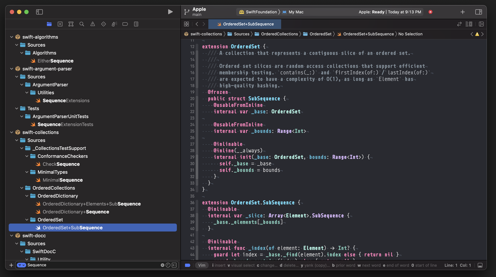

# Apple Repos

Clones and keeps Apple updated and adds packages and projects to a workspace to make it possible to access all of the code from a single Xcode Workspace.

Run Open Quickly with CMD-Shift-O to look for any code which is in these repos.

## List of Repos

The lists are simply Apple.txt and OSS.txt which are associated with Apple's public repos on GitHub which can be cloned and loaded into an Xcode Workspace. As more public repos are added these lists can be updated and the workspace can be rebuilt.

## Scripts

Use the following scripts to clone, rebuild the workspace and update each repo.

* refresh.sh (updates list of Apple repos with GitHub API)
* clone.sh (clones all repos in the list)
* update.sh (updates every repo using Git)
* rebuild.sh  (rebuilds workspace)

These scripts can also be run within Xcode with Build Phase Scripts defined in the Apple project in the workspace.
